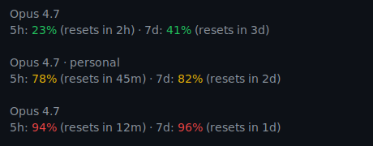

## About

My personal [Claude Code](https://claude.com/claude-code) configuration.

## Approach

- **Manual invocation only.** Every skill explicitly opts out of auto-loading. The default Claude Code behavior is to auto-select skills whose descriptions look relevant to the conversation, and I'd rather control which mode I'm in.

- **Workflow-driven.** Each skill is a workflow for one mode of work: shipping changes, reviewing code, writing tests, writing tickets, discussing product...

- **Global hard limits.** Universal guardrails applied across all skills, found in [`CLAUDE.md`](CLAUDE.md), which Claude Code auto-loads for every session.

- **Bypass permissions by default.** [`settings.json`](settings.json) sets `permissions.defaultMode: bypassPermissions` so Claude Code runs without prompting before each tool call. Work happens in version-controlled repositories, so `git diff` shows me exactly what changed, I found that approvals were more annoying than safe, so I turn them off.

## Skills

- **[`/database`](skills/database/SKILL.md)** — database design, querying, indexing, transactions; relational by default, scope-tagged for non-relational
- **[`/devops`](skills/devops/SKILL.md)** — DevOps and infrastructure mentorship
- **[`/draft-logo`](skills/draft-logo/SKILL.md)** — drafting a logo mark for a project via an iterative HTML gallery of SVG concepts
- **[`/handoff`](skills/handoff/SKILL.md)** — handing off a session's context to the next agent. Name inspired from [Matt Pockock](https://github.com/mattpocock/skills/)
- **[`/linux`](skills/linux/SKILL.md)** — Linux internals and operations
- **[`/meta`](skills/meta/SKILL.md)** — authoring Claude Code configuration (skills, CLAUDE.md, settings, hooks, agents, plugins)
- **[`/product`](skills/product/SKILL.md)** — product and UX decisions
- **[`/review-code`](skills/review-code/SKILL.md)** — structured code/PR feedback
- **[`/ship`](skills/ship/SKILL.md)** — extending and fixing production code
- **[`/test`](skills/test/SKILL.md)** — testing against requirements
- **[`/write-task`](skills/write-task/SKILL.md)** — turning work into a well-scoped development ticket

Invoke any of them by typing `/<name>` in Claude Code. They never run unless you ask.

## Install

```bash
git clone git@github.com:yamanidev/claude-code-configuration.git
cd claude-code-configuration
./install.sh
```

`install.sh` symlinks three things into a Claude Code config directory:

- `skills/` → `<config>/skills`
- `CLAUDE.md` → `<config>/CLAUDE.md`
- `settings.json` → `<config>/settings.json`

With no arguments, it targets the default `~/.claude`. Pass one or more paths to target a different config dir(s):

```bash
./install.sh ~/.claude-work ~/.claude-personal
```

That's the form to use if you run multiple Claude Code accounts side-by-side via `CLAUDE_CONFIG_DIR`, the setup I describe in [How to Use Multiple Claude Code Accounts (Work & Personal)](https://mohamedyamani.com/blog/multiple-claude-code-accounts-work-personal/).

To stay up-to-date with this configuration, just run `git pull`, updates propagate through the symlinks automatically.

Run `./install.sh --help` for usage details.

## Status line

The script also offers a statusline customization, requires `jq`. Off by default, pass `--statusline` to `install.sh` to enable it.
- Line 1: Active model and version, with the configuration directory name appended for multi-account setups
- Line 2: Usage for both the 5 hour and 7 days windows (color-coded by threshold), and current-session context as an absolute token count (green < 80k, yellow 80–160k, red ≥ 160k) as a heuristic tracking for quality degradation, independent of whether the model advertises a 200k or 1M window



## License

[MIT](LICENSE)
